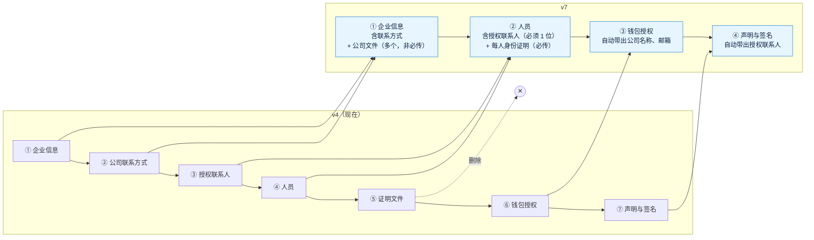

# 《需求说明书》v7：开户表单精简 + 集中限流 + 邮箱哈希检索
- 版本：v7
- 产出角色：产品经理（测试预审见 §7）
- 状态：⏸ 原型待 Amos 确认（澄清问题 Amos 已于 2026-10-01 回复"全部按默认"）
- 输入：`需求文档/v7-需求澄清问题.md`（Q1～Q11 全部按默认）
- 变更历史：v7（2026-10-01）首次创建

## 一图看懂：开户步骤 7 → 4

## 1. 背景与目标
- Amos 要求减少和合并开户时客户要填的内容，取消"证明文件"一步，改为公司文件选传、每位人员上传身份证明。
- 目标：步骤从 7 步减到 4 步；授权联系人只填一次；必传文件从"6 项公司文件 + 每人 2 项 + 钱包 1 项"减到"每人 1 项身份证明"。
- 同时处理 v6 的两项已知限制：L5（开放 API 的限流只在单个函数实例内计数）、L6（按邮箱搜索客户要解密最近 5000 个客户）。

## 2. 开户表单的变更点
### 2.1 字段对照表（agents C35：原表逐项 → v7）
| 原步骤 | 原字段 | v7 | 说明 |
|---|---|---|---|
| ① 企业信息 | 法定全称、注册商号 / 品牌、法律形式、注册号、成立日期、注册国家和地点、注册地址、实际经营地址 | ① 企业信息，不变 | |
| ① | LEI、税号（TIN）、集团 / 母公司 | **删除** | Q7。已填的数据保留，后台照常显示 |
| ① | 业务性质、业务用途、月交易量（及金额）、币种、目标市场、制裁声明（及说明） | ① 企业信息，不变 | |
| ② 公司联系方式 | 官网、公司邮箱、联系电话 | **并入 ① 企业信息**，仍必填 | Q5 |
| ② | 其他联系方式 | **删除** | Q5 |
| ③ 授权联系人 | 姓名、邮箱、电话 | **并入 ② 人员**：人员增加角色"授权联系人"，必须有且只有 1 位；这位的邮箱、电话必填 | Q6。**商户开通邮件发给这位的邮箱** |
| ③ | 其他联系方式 | **删除** | Q6 |
| ④ 人员 | 角色（董事 / UBO / 授权签字人） | ② 人员，角色增加"授权联系人" | 至少 1 名董事、1 名 UBO、恰好 1 名授权联系人 |
| ④ | 法定全名、出生日期、国籍、住址 | ② 人员，不变 | |
| ④ | 居住国 | **删除** | Q8 |
| ④ | 护照号码、护照签发国、护照到期日 | **改为**：证件类型（护照 / 身份证）、证件号码、签发国、到期日，都必填 | Q4 |
| ④ | 持股比例、投票权比例（仅 UBO）、PEP 及说明 | ② 人员，不变 | |
| ④ | 邮箱、电话 | ② 人员，**只有授权联系人必填**，其他人选填 | Q8 |
| — | — | **新增**：每位人员的身份证明文件，必传，1～3 个文件（正反面） | Q3、Q4 |
| ⑤ 证明文件 | 公司文件 d1～d6（必传）、d10、d13～d16（选传） | **删除这一步**；改为 ① 企业信息末尾的"公司文件"：可以传多个（最多 20 个），**非必传**，上方用文字说明可以传哪些文件 | Q1、Q2 |
| ⑤ | 每人护照（必传） | 改为 ② 人员里的身份证明 | |
| ⑤ | 每人地址证明（必传） | **删除** | Q1 |
| ⑥ 钱包授权 | 法定全称、邮箱 | ③ 钱包授权，**自动带出**企业法定全称、公司邮箱（可以改） | Q8 |
| ⑥ | 证件类型及号码、User ID | **删除** | Q8 |
| ⑥ | 钱包地址、网络、用途、所有权声明、风险确认 | ③ 钱包授权，不变 | |
| ⑥ | 所有权证明的类型、所有权证明文件 | **删除** | Q1 |
| ⑦ 声明与签名 | 授权代表姓名 | ④ 声明与签名，**自动带出**授权联系人的姓名（可以改） | Q8 |
| ⑦ | 职位、确认声明、手写签名 | ④ 声明与签名，不变 | |

### 2.2 公司文件的提示文字
> 可以上传：公司注册证书 / 设立文件、存续证明或商业登记摘录、公司章程、股东名册 / 股权结构表、公司地址证明、组织架构图、监管牌照或法律意见书、董事会决议 / 授权委托书、银行账户证明、财务报表、反洗钱政策摘要等。**非必传**，审核时如有需要我们会再联系您。PDF、JPG、PNG，每个不超过 10 MB，最多 20 个。

### 2.3 已有的申请（Q9）
- **已提交、已审核的**：后台照常显示原来的全部内容和文件（含已删除字段和旧文件），不受影响。
- **填写中的、被要求补件的**：打开时自动整理到新步骤——第 ③ 步的授权联系人变成一位人员（如果他本来就在人员里，按邮箱或姓名识别，只加上"授权联系人"角色）；护照的三项搬到证件信息（证件类型记为护照）；原来上传的护照算作身份证明，公司文件归入"公司文件"。删掉的字段不再显示，数据不删除。新增的必填项（例如没有护照文件的人员）补齐后才能提交。
- **后台要求补件**时可以勾选的部分改为：① 企业信息、② 人员、③ 钱包授权。

## 3. 技术改进
### 3.1 L5：开放 API 集中限流（Q10）
- 每个 API Key 每秒最多 20 个请求（不变），计数放在 Upstash Redis，所有函数实例共享。
- Redis 出错或超时时**放行**并记录日志，不因为限流故障挡住正常收款。
- 本地和自动化测试用内存版（行为一致）。

### 3.2 L6：按邮箱哈希检索客户（Q11）
- 客户表新增邮箱的检索哈希（统一转小写后，用 `APP_SECRET` 派生的专用密钥做 HMAC），数据库里仍然不存明文邮箱。
- 搜索框输入的是**完整邮箱**时，按哈希精确查找，不受客户数量限制；输入的是部分内容时，客户编号、名称照常模糊匹配，邮箱在最近的客户里模糊匹配（保持 v6 的体验）。
- 上线时自动给现有客户补算哈希；新建、修改客户时同步更新。

## 4. 明确不做
- 不做证件的自动识别（OCR）和真伪核验，由 Amos 人工审核。
- 不改审核流程本身（通过 / 拒绝 / 补件 / 删除不变）。
- 不改开放 API 的接口和字段（L5、L6 对商户透明）。

## 5. 验收标准
| # | 验收标准 |
|---|---|
| AC-7-1 | 开户页只有 4 步：企业信息、人员、钱包授权、声明与签名；中英两版一致 |
| AC-7-2 | ① 企业信息包含官网、公司邮箱、电话（必填），没有 LEI、税号、集团 / 母公司、其他联系方式 |
| AC-7-3 | ① 企业信息末尾可以上传多个公司文件，**不传也能提交**；有 §2.2 的提示文字；超过 20 个、类型或大小不对时前端提示，服务端也拒绝 |
| AC-7-4 | ② 人员的角色有"授权联系人"；没有或多于 1 位授权联系人时不能提交；授权联系人的邮箱、电话必填，其他人选填 |
| AC-7-5 | 每位人员都有证件类型（护照 / 身份证）、证件号码、签发国、到期日（必须晚于今天），没有居住国 |
| AC-7-6 | 每位人员都要上传身份证明（1～3 个文件），任何一人没有时不能提交；删除人员时一并删除他的文件 |
| AC-7-7 | 没有"证明文件"一步，没有地址证明、钱包所有权证明 |
| AC-7-8 | ③ 钱包授权的法定全称、邮箱自动带出 ① 填的内容（为空时才带出，可以改）；没有证件类型及号码、User ID；④ 授权代表姓名自动带出授权联系人 |
| AC-7-9 | 审核通过后，运营后台"待开通"列表里的邮箱是授权联系人的邮箱；v4 及以前的申请仍取原来第 ③ 步的邮箱 |
| AC-7-10 | v4 格式的已提交申请，后台详情照常显示全部原有内容和文件；v4 格式的填写中申请打开后按 §2.3 整理，已填内容不丢 |
| AC-7-11 | 后台详情按新结构显示：企业信息（含联系方式）、公司文件、每位人员（含身份证明文件）、钱包授权、声明与签名；要求补件时可勾选的是 3 个新步骤 |
| AC-7-12 | **L5**：同一个 API Key 在两个服务器实例上合计每秒超过 20 次时返回 429；Redis 不可用时请求照常处理 |
| AC-7-13 | **L6**：输入完整邮箱能找到对应客户，即使该客户不在最近 5000 个里；数据库里没有明文邮箱；现有客户上线后能按邮箱找到 |
| AC-7-14 | 页面走查（C42～C45）：4 个步骤在桌面和手机上、空状态、出错状态都正常 |

## 6. 跨角色反馈 / 分歧记录
| 编号 | 提出方 → 接收方 | 内容 | 状态 |
|---|---|---|---|
| FB-v7-1 | PM → Amos | 公司文件改为非必传后，审核时资料可能不全，可以用"补件"让企业补交 | 已采纳（Amos：全部按默认） |

## 7. 测试预审（测试工程师）
| 验收标准 | 判定方式 |
|---|---|
| AC-7-1～8 | 端到端测试：逐步填写并截图；前端拦截 + 直接调接口验证服务端拒绝（`kyb.spec.ts`）；单元测试覆盖服务端校验（`kyb-core.test.js`） |
| AC-7-9 | 单元测试：v7 和 v4 两种申请审核通过后，`approvedFromKyb` 返回的邮箱 |
| AC-7-10 | 单元测试：用 v4 格式的申请数据（提交的和填写中的）分别验证后台详情和打开后的整理结果 |
| AC-7-11 | 端到端测试：后台详情的各个部分和补件可勾选项 |
| AC-7-12 | 单元测试：两个限流器实例共享同一个 Redis 替身，合计超过 20 次返回 429；Redis 抛错时放行 |
| AC-7-13 | 单元测试（内嵌和真实 Postgres）：造 6000 个客户，按第 1 个客户的完整邮箱能找到；表里没有明文邮箱；迁移后旧客户有哈希 |
| AC-7-14 | 页面走查脚本（`walkthrough.spec.ts`）增加开户页 |
- 预审结论：全部可测，无疑问。

## 8. PM 自检
- [x] 写明了做什么、不做什么
- [x] 每条验收标准可衡量，已经过测试预审
- [x] 附了原文到新字段的对照表（C35）
- [x] 开头有"一图看懂"
