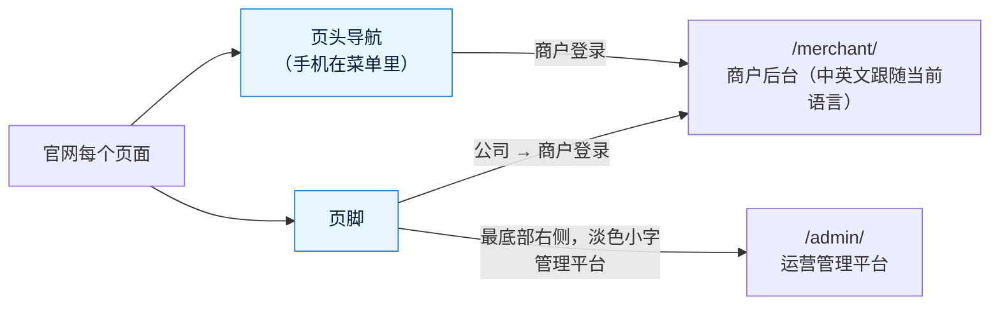

# 《需求说明书》v7.1：官网增加商户登录和管理平台入口
- 版本：v7.1
- 产出角色：产品经理（测试预审见 §4）
- 状态：✅ 已生效（Amos 于 2026-10-01 确认原型："确认原型"，§2 的默认做法一并确认）
- 输入：Amos 的原话（2026-10-01）："商户后台已经上线，可以在官网增加一个商户登录的入口了，同时在页面最底部不显眼的位置放一个管理平台登录的入口"
- 变更历史：v7.1（2026-10-01）首次创建。改动小，澄清问题按默认值写在 §2，Amos 确认原型时一并确认

## 一图看懂

## 1. 改动
| 位置 | 内容 |
|---|---|
| 页头导航 | "关于我们"后面、语言切换前面加文字链接"商户登录"（英文 Merchant login），和其他导航同样的样式。中文页面链到 `/zh/merchant/`，英文页面链到 `/merchant/` |
| 手机菜单 | 菜单展开后，"商户登录"和语言切换、"预约演示"在同一行 |
| 页脚"公司"一栏 | 最后加一项"商户登录" |
| 页脚最底部 | 版权一行的右侧加"管理平台"（英文 Admin）：比版权文字更小、颜色更淡，鼠标移上去才变亮；链到 `/admin/`，带 `rel="nofollow"`，不进搜索引擎 |
| 页头宽度 | 加了"商户登录"后，英文导航在 1100 像素以下放不下（Logo 和导航文字会折成两行），所以 1100 像素以下改用菜单（原来是 960） |

## 2. 默认做法（请 Amos 确认原型时一并确认）
| # | 问题 | 默认 |
|---|---|---|
| Q1 | 商户登录放在哪里？ | 页头导航 + 页脚"公司"一栏，两处都有 |
| Q2 | 商户登录用文字链接还是按钮？ | 文字链接，不和"预约演示"抢注意力 |
| Q3 | 管理平台入口的文字 | "管理平台"（英文 Admin），只在页脚最底部，淡色小字 |
| Q4 | 管理平台入口要不要隐藏得更深（例如只在鼠标移上去时显示）？ | 不隐藏，只是不显眼。后台本身有密码和动态码保护，入口位置不影响安全 |

## 3. 验收标准
| # | 验收标准 |
|---|---|
| AC-7.1-1 | 官网每个页面（中英文）的页头都有"商户登录"，点击进入对应语言的商户后台登录页；手机菜单里也有 |
| AC-7.1-2 | 页脚"公司"一栏有"商户登录" |
| AC-7.1-3 | 页脚最底部有"管理平台"，字号和颜色比版权更淡，点击进入 `/admin/`；链接带 `rel="nofollow"` |
| AC-7.1-4 | 375、768、1024、1280 宽度下没有横向滚动，页头文字不折行 |
| AC-7.1-5 | 站点地图不包含商户后台和管理平台（不变） |

## 4. 测试预审
| 验收标准 | 判定方式 |
|---|---|
| AC-7.1-1～3 | 端到端测试：逐页检查链接地址、可见性、点击后的页面（`pages.spec.ts`） |
| AC-7.1-4 | 端到端测试：几种宽度检查横向滚动和页头文字高度 |
| AC-7.1-5 | 端到端测试：站点地图里没有 `/merchant/`、`/admin/` |

- 预审结论：全部可测。
