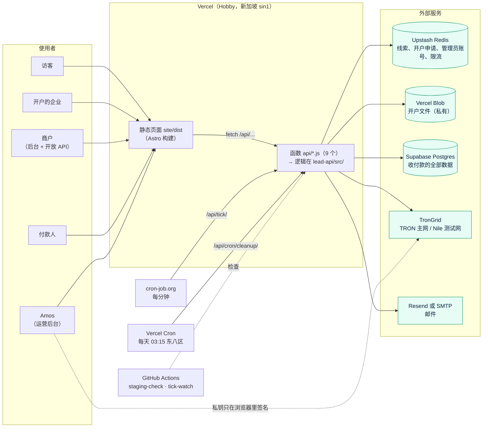

# 项目地图：amos111（Quick Come）
- 用途：**新加入的人或大模型先读这一份**，10 分钟了解项目现在是什么样、代码在哪里、有哪些不能破坏的约定。要查某个具体的文件、接口、表、变量、历史问题，看《[项目索引](项目索引.md)》。
- 只写**当前状态**。历史设计看 `00-架构方案.md` 和各版本文档，那些是当时的记录，可能已经过时；两边不一致时，以本文件和代码为准。
- 版本：v7.1（2026-10-01，对应代码：v7 开户表单 7 步改 4 步 + 开放 API 集中限流 + 客户邮箱哈希检索；v7.1 官网的商户登录和管理平台入口）
- 维护：研发负责（agents 规则 C53）。**每次功能迭代，在同一个 PR 里更新本文件和《项目索引》**。`lead-api/test/project-index.test.js` 会检查索引有没有漏掉文件、接口、数据库表和环境变量。
- 变更历史：v6.3（2026-09-30）首次创建（Amos 要求：让新的大模型能快速、准确地了解项目）；v6.3.1（2026-10-01）新增 CI、通用检查脚本、冷启动问题清单；v7.0（2026-10-01）开户 4 步、旧申请兼容、限流和邮箱检索（约定 13～15）；v7.1.1（2026-10-03）写明开发分支的用法（agents C62 做法 A）；v7.0.1（2026-10-01）冷启动检查后补充：收不到回调的排查步骤、回调失败的判断、429 的返回、测试环境没有每日任务等

## 一图看懂



## 1. 这个项目做什么
| 业务 | 版本 | 使用者 | 页面 | 接口 | 数据 |
|---|---|---|---|---|---|
| 官网 + 预约演示表单（v7.1：页头、页脚有"商户登录"，页脚最底部有"管理平台"入口） | v1、v2、v7.1 | 访客 | `/`、`/contact/` 等（中英，中文在 `/zh/`） | `/api/leads/` | Redis `qc:leads` |
| 线上开户（KYB）资料收集（4 步：企业信息和公司文件、人员和身份证明、钱包授权、声明与签名） | v3、v4、v7 | 开户的企业（凭链接） | `/onboarding/?t=<令牌>` | `/api/kyb/?g=onboarding` | Redis（加密）+ Blob |
| 审核后台（开户部分） | v3 | Amos | `/admin/` 的"开户申请""官网线索" | `/api/kyb/?g=admin` | 同上 |
| **稳定币收付款（TRON USDT）** | v6 | 商户、付款人、Amos | `/merchant/`、`/pay/<订单号>/`、`/docs/`、`/admin/` 的"收付款" | `/api/merchant/`、`/api/v1/`、`/api/pay/`、`/api/wallet/`、`/api/tick/` | Supabase |

收付款的一笔钱怎么走：付款人把 USDT 转到**客户的永久地址**（由主助记词的公钥推导，一个客户一个） → 每分钟扫链入账、扣收款手续费、匹配订单、发回调 → 商户申请提币，Amos 审核后**在浏览器里签名**，从热钱包转出 → 客户地址里的钱由 Amos **归集**到热钱包（冷钱包暂未配置）。

## 2. 代码怎么分层
```
api/*.js                只做入口：初始化依赖（api/_lib.js、_kyb.js、_pay.js），把请求交给 lead-api 的处理函数
lead-api/src/           全部业务逻辑。依赖通过参数传入，所以 Vercel 函数、本地服务器、单元测试共用同一份代码
  handler.js 等          v1 表单
  kyb/                  v3 开户和审核后台
  pay/                  v6 收付款（数据库、扫链、匹配、回调、签名、各个后台接口）
  local-server.js       本地服务器：模拟 Vercel（静态文件、改写规则、响应头、只转发真实存在的函数）
site/                   Astro 静态站点。页面是 .astro，交互在 site/src/scripts/*.ts
  和后端共用的纯函数直接 import lead-api/src/pay/ 下的文件（money、matching、verify、txcodec、signing），保证规则只有一份
e2e/                    Playwright 端到端测试（测试负责），stack.mjs 启动本地的整套环境
config/wallets.json     各环境的热钱包、冷钱包地址（公开信息；构建时写进签名页面，服务器改不了）
```
- 一组相关接口合并成一个函数，用查询参数区分动作（`?a=<动作>`）：Vercel Hobby 每次部署最多 12 个函数（BUG-K8）。现在是 9 个。
- 不要用 `[xxx].js` 这种动态文件名（BUG-K7，线上 404）。
- 页面有三种模式（`site/src/lib/env.ts`，**构建时**决定）：**测试环境**（`APP_ENV=staging`，页面顶部有标识，真实接口）；**原型**（其他 Vercel 预览环境 `VERCEL_ENV=preview`，或本地 `PROTOTYPE=1`，用 `v6-mock.ts` 的模拟数据，不调用接口）；**生产**。所以开发分支的预览地址永远是原型。

## 3. 环境
| 环境 | 分支 | 地址 | 数据 | TRON |
|---|---|---|---|---|
| 本地开发 | 任意 | `npm run dev:local` → http://127.0.0.1:8080 | `DATA_DIR` 下的本地文件、Redis 替身、内嵌 Postgres（PGlite）；设 `LOCAL_PG_URL` 时用真实 Postgres | 替身（默认；`FAKE_TRON=0` 并配置 `TRONGRID_API_KEY` 时连真实网络） |
| 端到端测试 | 任意 | `e2e/stack.mjs` 启动 5 个本地服务器和 1 个模拟 SMTP：8080 主实例（放宽了官网表单的限流）、3002（官网表单用默认限流，专门测"第 6 次提交返回 429"）、8090 原型构建、8092 测试环境构建、**8094 收付款**、2525 模拟 SMTP | 同上；设 `E2E_DATABASE_URL` 时用真实 Postgres | 替身 |
| 原型预览 | 开发分支 | Vercel 预览地址（需要登录 Vercel） | 模拟数据 | 无 |
| **测试环境** | `staging` | https://amos111-git-staging-jeffzhaifei-3827s-projects.vercel.app/ （有访问保护） | Supabase `quickcome-staging` | **Nile 测试网** |
| **生产** | `main` | https://amos111.vercel.app/ | Supabase `quickcome-prod` | **主网（真实资金）** |

- 发布流程（agents C34、C54）：开发分支 → PR 到 `staging`，**CI（`.github/workflows/ci.yml`：单元测试 + 端到端测试）必须通过才能合并**（GitHub 分支保护已在 2026-10-01 对 `staging`、`main` 开启，`unit`、`e2e` 为必须通过的检查，管理员也不能绕过） → 合并后 `staging-check` 检查测试环境 → Amos 在测试环境验收 → PR `staging` → `main`（CI 再跑一次）→ 上线 → 生产冒烟检查 `e2e/smoke-prod.sh`。
- 开发分支（agents C62，Amos 2026-10-03 选定做法 A）：amos111 只由一个窗口维护，固定使用一个开发分支 `claude/four-agent-collaboration-framework-c61foy`，**一次只做一个任务**：任务开始前先把最新的 `staging` 合进来，这个任务的 PR 合并后才开始下一个。以后如果要多个窗口同时维护，改为每个任务一个分支。
- 密钥（数据库连接串、`APP_SECRET`、`TICK_SECRET` 等）只由 Amos 填在 Vercel、GitHub、cron-job.org 里，**不经过 AI、不进仓库**。变量名和作用见《项目索引》§5。
- 生产热钱包 `TJwzqVh6n9XyMrrAdubTzkyUKMyQJwu7oL`；测试环境热钱包 `TN2MQMfG6d5XY2REqUVG7dMmisY7E8c2n8`；冷钱包都没有配置（`config/wallets.json`，其中 `usdt` 是签名页面认可的 USDT 合约；`local` 一组只给自动化测试用，`local.cold` 是占位地址）。
- **`TRON_NETWORK` 不设时默认是主网**：新建环境时必须明确设置（测试环境设 `nile`）。健康检查会返回当前网络，`staging-check` 会检查测试环境连的是 Nile。

## 4. 关键流程在哪里
| 流程 | 入口 | 核心代码 |
|---|---|---|
| 每分钟任务：扫链 → 订单过期 → 提币确认 → 归集推进 → 回调 → 提币通知 | `api/tick.js` | `lead-api/src/pay/tick.js` |
| 入账、手续费、匹配、余额和账本 | 扫链调用 | `pay/core.js`（事务、锁客户）、`pay/matching.js`（纯规则） |
| 回调（签名、禁止内网地址；返回 2xx 算成功，其他状态码、超时（5 秒）、连不上都算失败；失败后从第一次发送算起 1、5、30、120、360、720、1440 分钟重试，即最多发 8 次，都失败后状态为 `failed`。事件和内容见 `site/src/docs/api-reference.mjs` 的 `EVENTS`，例如 `order.matched` 带订单的 `OrderCore`） | 每分钟任务 | `pay/callbacks.js`（`RETRY_MIN`、`deliverDue`） |
| 提币：商户申请 → Amos 审核 → 浏览器签名 → 广播 → 链上确认 | `/api/merchant/?a=withdraw`、`/api/wallet/?a=withdraw-plan` | `pay/ops.js`、`pay/wallet-api.js`、页面 `admin-pay-real.ts` |
| 归集：① 借出能量（热钱包能量够时）或补 TRX → ② 转出 USDT → ③ 收回能量（只有第 ① 步是借能量时才有）。第 ① 步由页面签名后广播，后面每步由每分钟任务在上一步确认后推进 | `/api/wallet/?a=sweep-plan` | `pay/wallet-api.js`（`sweep-plan`、`sweepProgress`） |
| 浏览器签名：页面自己解码交易、逐项核对，不对就不签 | 运营后台 | `pay/txcodec.js`、`pay/verify.js`、`pay/signing.js`（浏览器和服务器共用） |
| 每日：对账、其他代币检查、提醒；开户资料到期清理 | `api/cron/cleanup.js` | `pay/daily.js`、`kyb/admin.js`（`createCleanup`） |
| 开户：填写、上传、提交 → 审核 → 开通收付款 | `/api/kyb/` | `kyb/onboarding.js`、`kyb/admin.js`、`pay/kyb-link.js` |

## 5. 不能破坏的约定
1. **金额一律是整数**，单位 0.000001 USDT（`bigint`）；比例按百万分之一存（1% = 10000）。对外（接口、回调、页面）一律是字符串，例如 `"100.50"`。转换靠 `pay/common.js` 的 `money()` 和 `AMOUNT_KEYS` 名单；**新增金额字段必须加进名单**，端到端测试会扫描所有接口的返回，漏了就失败（BUG-P9～P11）。
2. **系统不保存任何私钥**。服务器只有账户级公钥（xpub），只能推导地址。主助记词和热钱包私钥只在 Amos 的浏览器里签名时使用。签名页面允许的目标地址只来自 `config/wallets.json`。
3. **余额只通过账本改动**：`balances` 有 `>= 0` 约束，每次改余额都在一个事务里追加一条 `ledger`（只追加，不修改）。
4. **同一个客户的匹配先锁客户**（`select … for update`），到账和建单同时发生也不会重复匹配。
5. **数据库并发**：`pay/db.js` 限制同时进行的查询数（最多 3 个，事务内 1 个）。同时发出很多查询，经过 Supabase 连接池会卡住（BUG-P22）。jsonb 参数由自定义序列化处理，不要传已经 `JSON.stringify` 过的字符串（BUG-P5）。
6. **扫链只读到已确认区块**，重叠 3 分钟；订单过期后再等 5 分钟才关闭（BUG-P13、P14）。
7. **低于 1 USDT 的转入**只记为异常，不入账、不通知，**不给商户看**（需求 v6.2）。
8. **测试网和主网要分清**：`TRON_NETWORK`；Tronscan 链接在生产指向主网，其他环境指向 `nile.tronscan.org`。
9. **商户隔离**：`pay/ops.js` 每个函数第一个参数都是商户，所有查询都限定在这个商户下。
10. **开放 API** 每个请求都要签名，POST 必须带 `Idempotency-Key`；文档的字段说明（`site/src/docs/api-reference.mjs`）和接口的实际返回由测试逐字段核对。
11. **页面安全**：页面只用 `textContent` 写文字（`site/src/scripts/ui.ts` 的 `h()`），不拼接 HTML。
12. **管理员只有一套账号**：开户后台和收付款后台共用（Redis `qc:admin`），签名前还要再输入一次验证码，同一个码不能用两次。
13. **开户表单有新旧两种格式，都要能显示**（v7）：新格式 `form.v = 7`（版本号是 `kyb/schema.js` 的 `FORM_VERSION`），4 个步骤（`kyb/schema.js` 的 `SECTIONS`），文件只有 `company`（公司文件，选传）和 `id`（每位人员的身份证明，必传）。v4 及以前的申请（7 步，有 `contact`、`rep`、`d1`～`d16`、`passport`、`poa`、`walletProof`）**已提交的原样保留**，后台照常显示；**填写中、补件中的**在客户打开时由 `upgradeToV7` 整理（只在内存里，下次保存时写回），删掉的字段**数据不删**（`keepLegacy`）。改表单字段时，前端 `site/src/scripts/onboarding.ts`、后端 `kyb/schema.js`、后台 `site/src/scripts/admin.ts` 的 `LABELS` 三处要一致，旧字段的名称放在文案 `site/src/i18n/onboarding.json` 的 `legacy` 里（后台 `admin.ts` 的 `LABELS` 就是从这份文案的 `s1`～`s4` 和 `legacy` 拼出来的，所以只改文案即可）。
14. **开放 API 限流是集中计数**（v7，L5）：每个 API Key 每秒 20 次（按函数实例的时钟取整到秒），超过返回 429，内容 `{"error":{"code":"rate_limited","message":"Too many requests"}}`，不带 `Retry-After`；计数在 Redis（`qc:v1rl:*`，和开户共用同一个 Upstash），Redis 出错或 1 秒没响应时**放行**并记日志 `RATE_LIMIT_UNAVAILABLE`（`pay/api-v1.js` 的 `createRateLimiter`）。
15. **客户邮箱不存明文**：`customers.email_enc` 是密文，`email_hash` 是检索用的 HMAC（`pay/common.js` 的 `emailHash`，转小写后计算）。**改客户邮箱的地方必须同时写这两列**（`pay/ops.js`、`pay/core.js` 的 `ensureCustomer`）。搜索完整邮箱走哈希，部分邮箱只在最近 5000 个客户里解密比对。

## 6. 常用命令
| 做什么 | 命令（在仓库根目录） |
|---|---|
| 安装 | `npm ci && (cd site && npm ci) && (cd e2e && npm ci)` |
| 单元测试（113 个） | `npm test` |
| 单元测试用真实 Postgres | `TEST_DATABASE_URL=postgres://... npm test` |
| 项目地图和索引检查 | `node scripts/check-project-index.mjs`（`npm test` 也会运行） |
| 构建页面 | `cd site && npm run build`（先检查中英文案结构一致） |
| 端到端测试（224 个） | `cd e2e && npx playwright test`；用真实 Postgres：加 `E2E_DATABASE_URL=...` |
| 页面走查（截图 + 自动检查） | 先构建页面，再 `cd e2e && WALKTHROUGH=1 WALKTHROUGH_OUT=<目录> npx playwright test tests/walkthrough.spec.ts` |
| 本地运行 | `npm run dev:local` |
| PR 的自动检查 | GitHub Actions `ci`（每个 PR 自动运行，结果在 PR 页面） |
| 测试环境检查 | GitHub Actions `staging-check`（合并到 `staging` 自动运行） |
| 生产冒烟检查 | `bash e2e/smoke-prod.sh https://amos111.vercel.app` |
| 看线上状态 | `https://<地址>/api/health/`（只返回"是否已配置"，不返回值）；`/api/tick/?health=1` |

## 7. 排查从哪里开始
1. 先看健康检查 `/api/health/`：哪一项是 `false`，就是哪个配置缺了或不对。
   - **商户说收不到回调**：① `/api/tick/?health=1` 看每分钟任务在不在跑（回调由它发出）；② 商户后台"回调记录"（表 `callbacks`）看状态、重试次数、上次状态码：状态码不是 2xx 是商户那边的问题，`failed` 表示 8 次都失败了；③ 回调地址必须是 https、不能是内网（`callback-save`）；④ 可以用"重新发送"（`callback-resend`）或"测试回调"（`callback-test`）；⑤ 商户验签参考 `site/src/docs/verify-callback.mjs`。
2. 再看《项目索引》§8 **问题索引**：按症状找到历史上的同类问题、原因和修复位置。
3. 线上报错看 Vercel → 项目 → Logs（需要 Amos 截图）；链上的事看 Tronscan（测试网用 `nile.tronscan.org`）。
4. 本地先复现：`e2e/stack.mjs` 的 8094 实例和线上用同一份代码；怀疑数据库驱动的问题，用真实 Postgres 跑（本地 PG 16 的启动方法见《项目索引》§7；CI 每次都用真实 Postgres 16 跑一遍）。
5. 遗留事项和已知限制看最新一份《交付记录/v*-交付说明.md》的"已知限制和待办"。

## 8. 常见改动的检查清单
| 改动 | 要改的地方 |
|---|---|
| 接口新增一个字段 | 数据来源（`pay/schema.js` 加列要写成可重复执行、`pay/core.js`）→ **输出对象是手工拼的**：`pay/ops.js`（开放 API 和商户后台）或 `pay/wallet-api.js`（运营后台），列表、详情、创建各处都要加 → 金额字段加进 `pay/common.js` 的 `AMOUNT_KEYS` → 开放 API 的字段在 `site/src/docs/api-reference.mjs` 里补说明（回调带这个对象时还有 `EVENTS`）→ 页面显示 → 跑 `npm test`（字段对照）和端到端测试（金额扫描） |
| 新增环境变量 | 优先在 `lead-api/src/config.js` 读取（去首尾空白）；页面构建用的在 `site/src/lib/env.ts` 或 `site/astro.config.mjs`；本地和测试专用的可以在 `local-server.js`、`e2e/stack.mjs` 直接读 → `lead-api/.env.example` → 需要检查时加进 `api/health.js`（只返回是否已配置）→ 《项目索引》§5 → 告诉 Amos 在哪个平台、哪个环境填值 |
| 新增接口动作 | 在对应的处理文件里加动作（`handle.actions` 自动包含）→ 《项目索引》§2（测试会核对）→ 开放 API 还要写进 `api-reference.mjs` |
| 新增函数文件 `api/*.js` | 先确认不超过 12 个（Hobby），能合并进已有函数就合并 → `lead-api/src/local-server.js` 加转发 → 《项目索引》§1.2、§2 |
| 新增数据库表或列 | `pay/schema.js`（`if not exists`，可以重复执行；上线时第一次请求自动执行）→ 《项目索引》§4.1 |
| 开户表单增删字段 | `kyb/schema.js`（字段、必填规则；删掉的字段不要删数据，`keepLegacy` 会保留。**文件类字段**还要改 `DOC_IDS`、`docSection`、数量上限 `MAX_COMPANY_FILES`/`MAX_ID_FILES`，以及前端的同名常量 `site/src/lib/onboarding.ts`）→ `site/src/i18n/onboarding.json` 中英两份（旧字段的名称移到 `legacy`）→ `site/src/pages/[...lang]/onboarding.astro` → `site/src/scripts/onboarding.ts`（前端校验）→ `site/src/scripts/admin.ts`（后台详情）→ 已有申请怎么办（需要整理时改 `upgradeToV7` 并提高 `FORM_VERSION`）→ `kyb-core.test.js`、`kyb-flow.test.js`、`e2e/tests/kyb.spec.ts` |
| 新增后台页面或标签 | 页面 `.astro` 里加标签 → 渲染函数 → 5 种状态（加载中、出错和重试、空、有数据、超过一页）→ 走查 → 《项目索引》§3 |

## 9. 冷启动问题清单
每轮迭代结束时（agents C53），让一个没看过项目的智能体**只读** `CLAUDE.md`、本文件和《项目索引》回答下面的问题，答错或找不到的地方就补充文档。问题可以随项目增加，不要删。
1. 商户说"收不到回调"，从哪里开始排查？重试规则是什么、在哪个文件？
2. 给开放 API 的订单返回新增一个金额字段，要改哪些文件（包括文档和测试）？
3. 测试环境的每分钟任务是谁调用的？需要哪个口令变量？连的是哪个 TRON 网络？
4. 运营后台"归集"页面的前端在哪个文件的哪个函数？调用后端哪些动作？分几步？
5. 生产环境的地址和热钱包地址是什么？
6. 新增一个环境变量，应该在哪里读取，还要更新哪些地方？
7. 一个 PR 合并前要通过哪些自动检查？没通过时去哪里看原因？
8. 开户表单删掉一个字段，已经填过这个字段的申请会怎样？后台还能看到吗？要改哪些文件？
9. 开放 API 返回 429 是什么原因？限流计数存在哪里？Redis 出故障时会怎样？
10. 回调怎样算失败？一条回调最多发几次？
11. 测试环境有没有每日任务（对账、开户资料清理）？要在测试环境对账怎么办？
